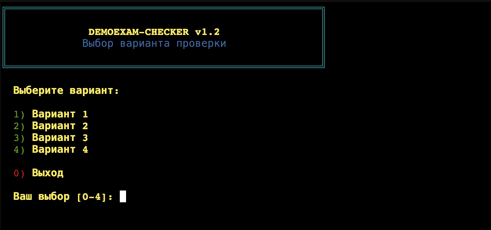
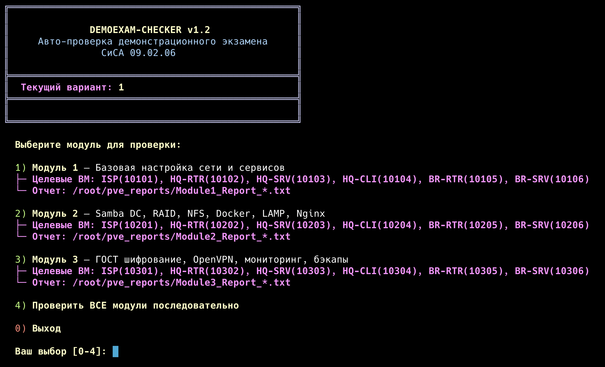

# PVE DemoExam Checker 2026

Скрипты для автоматической проверки выполнения задач демонстрационного экзамена по компетенции "Сетевое и системное администрирование" (СиСА 09.02.06).

Скрипты проверяют конфигурацию виртуальных машин Proxmox VE (PVE) через QEMU Guest Agent.

## Быстрый запуск на сервере PVE

Для запуска проверки достаточно выполнить одну команду на вашем сервере PVE под пользователем **root**:

```bash
bash <(curl -sSL https://raw.githubusercontent.com/rokkiBalboa-sourse/pve_check/main/run.sh)
```

### Что делает этот загрузчик (`run.sh`):
1. Проверяет наличие прав суперпользователя (`root`).
2. Если на сервере установлен `git`, клонирует репозиторий в папку `/root/pve_checks` (или обновляет его через `git pull`, если он уже был клонирован).
3. Если `git` не установлен, автоматически создаёт структуру папок и скачивает все необходимые файлы напрямую с GitHub с помощью `curl`.
4. Делает скрипты исполняемыми и автоматически запускает интерактивное меню `menu.sh`.

## Скриншоты работы

### Главное меню (`menu.sh`)


### Пример прохождения проверки


---

## Структура проекта

* `pve_checks/` — основная папка со скриптами проверки:
  * `menu.sh` — главное интерактивное меню (выбор варианта экзамена и запуск модулей).
  * `v1/`, `v2/`, `v3/`, `v4/` — папки с тестами под разные варианты экзамена:
    * `module1_check.sh` — проверка Модуля 1 (Сеть, базовые сервисы).
    * `module2_check.sh` — проверка Модуля 2 (Samba DC, RAID, NFS, Docker, LAMP, Nginx).
    * `module3_check.sh` — проверка Модуля 3 (ГОСТ шифрование, OpenVPN, мониторинг, бэкапы).
* `run.sh` — скрипт быстрой инициализации и запуска проверки по ссылке.

---

## Требования
1. Запуск от имени `root` на сервере Proxmox VE.
2. Включенный и настроенный **QEMU Guest Agent** на проверяемых виртуальных машинах (так как для проверок используется команда `qm guest exec`).

---

## Дисклеймер (Disclaimer)

> [!WARNING]
> Вы используете данные скрипты на свой собственный страх и риск. Используя этот инструмент, вы подтверждаете, что полностью понимаете, как работает скрипт и какие команды он выполняет. Разработчик не несет ответственности за ваши ошибки, сбои или любые нежелательные последствия на целевых серверах.

