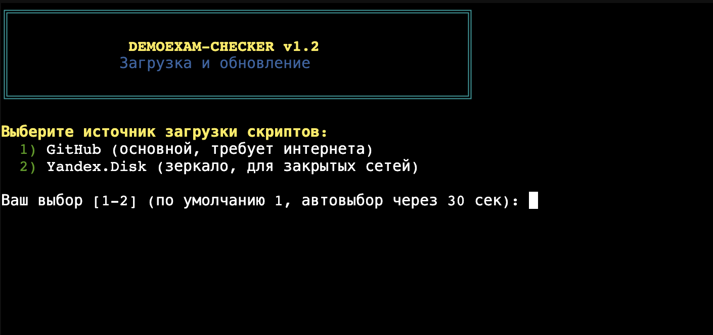
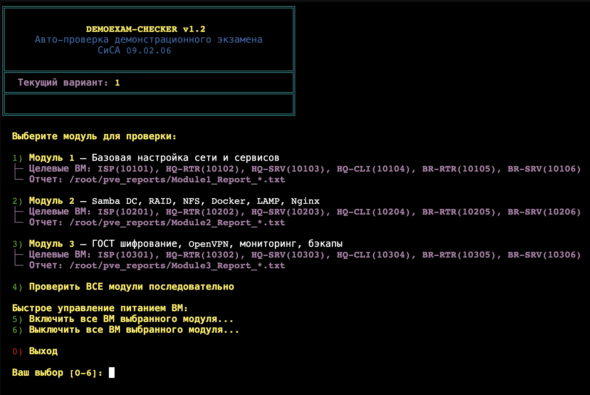

# PVE DemoExam Checker 2026

Скрипты для автоматической проверки выполнения задач демонстрационного экзамена по компетенции "Сетевое и системное администрирование" (СиСА 09.02.06).

Скрипты проверяют конфигурацию виртуальных машин Proxmox VE (PVE) через QEMU Guest Agent.

---

## Быстрый запуск на сервере PVE

Для запуска проверки достаточно выполнить одну команду на вашем сервере PVE под пользователем **root**:

```bash
bash <(curl -sSL https://raw.githubusercontent.com/rokkiBalboa-sourse/pve_check/main/run.sh)
```

### Что делает этот загрузчик (`run.sh`):
1. **Выбор источника:** Предлагает выбрать между GitHub и зеркалом Yandex.Disk (удобно для корпоративных сетей с фаерволом). Если выбор не сделан в течение 30 секунд, загрузка пойдет автоматически с GitHub.
2. **GitHub с Git:** Если выбран GitHub и на сервере установлен `git`, клонирует репозиторий в `/root/pve_checks` (или обновляет через `git pull`, если репозиторий уже склонирован).
3. **GitHub без Git:** Если `git` не установлен, скачивает файлы по одному через `curl`, выводя красивый графический прогресс-бар от 0% до 100%.
4. **Yandex.Disk:** Скачивает предварительно упакованный ZIP-архив через Yandex Cloud API, распаковывает его с помощью встроенного в PVE Python 3 и удаляет архив.
5. **Запуск:** Делает скрипты исполняемыми и запускает интерактивное меню `menu.sh`.

---

## Как настроить зеркало на Yandex.Disk

Если в вашей сети заблокирован GitHub, настройте скачивание с Яндекс.Диска:

1. **Создайте архив:** Запакуйте файлы вашего репозитория (папки `v1-v4`, скрипты `menu.sh` и `run.sh`) в ZIP-архив (например, `pve_check.zip`). 
   * *Важно:* Файлы должны лежать в корне архива, без промежуточных папок.
2. **Загрузите на Яндекс.Диск:** Залейте архив на свой Яндекс.Диск и сделайте на него **публичную ссылку**.
3. **Пропишите ссылку в скрипт:** В файле `run.sh` найдите переменную `YANDEX_DISK_PUBLIC_LINK` и вставьте туда вашу ссылку:
   ```bash
   YANDEX_DISK_PUBLIC_LINK="https://disk.yandex.ru/d/ваш_код_ссылки"
   ```
4. **Загрузите изменения:** Залейте измененный `run.sh` на свой GitHub. Теперь на сервере PVE загрузчик сможет скачивать архив с Яндекс.Диска.

---

## Скриншоты работы

### Выбор источника загрузки (`run.sh`)


### Главное меню (`menu.sh`)


### Пример прохождения проверки


---

## Структура проекта

Все файлы скачиваются в папку `/root/pve_checks/` и лежат там напрямую:
* `menu.sh` — главное интерактивное меню (выбор варианта экзамена и запуск модулей).
* `run.sh` — скрипт инициализации, обновления и запуска проверки по ссылке.
* `v1/`, `v2/`, `v3/`, `v4/` — папки с тестами под варианты экзамена:
  * `module1_check.sh` — проверка Модуля 1 (Сеть, базовые сервисы).
  * `module2_check.sh` — проверка Модуля 2 (Samba DC, RAID, NFS, Docker, LAMP, Nginx).
  * `module3_check.sh` — проверка Модуля 3 (ГОСТ шифрование, OpenVPN, мониторинг, бэкапы).
* `screenshots/` — скриншоты для README.

---

## Требования
1. Запуск от имени `root` на сервере Proxmox VE.
2. Включенный и настроенный **QEMU Guest Agent** на проверяемых виртуальных машинах (так как для проверок используется команда `qm guest exec`).

---

## Дисклеймер (Disclaimer)

> [!WARNING]
> Вы используете данные скрипты на свой собственный страх и риск. Используя этот инструмент, вы подтверждаете, что полностью понимаете, как работает скрипт и какие команды он выполняет. Разработчик не несет ответственности за ваши ошибки, сбои или любые нежелательные последствия на целевых серверах.
